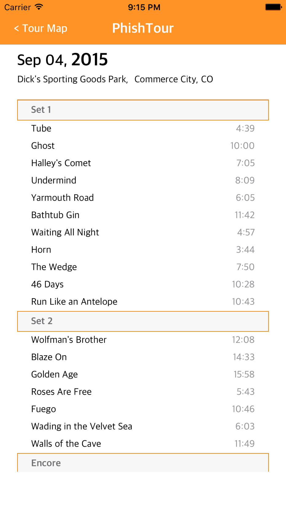
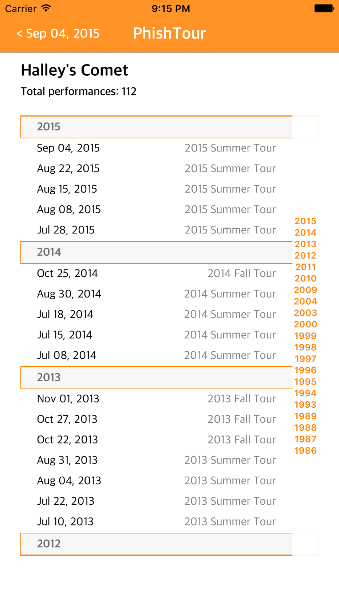

# PhishTour
Udacity iOS Nanodegree Project 5

Browse Phish's touring history and follow specific tours! Go from show to show (VW Bus not provided).
Check out a show's setlist, or see a song's performance history.

## Instructions
From the map, press the Select Tour button to bring up the tour selecter. Use the pickers to choose a year and a tour. Press the Follow Tour button to see that tour displayed on the map. Each stop on the tour will be annotated with a pin. Tap a pin to see the show(s) played there. Or, press the List button to scroll through all of the shows at once. You can press the Reset button to start over.

From any pin callout, or from the list, press the setlist icon to see the setlist for that show. You'll see each song played by set and their durations.

Tap on any song to see it's performance history. You'll see every show the song has been played at, with the date and the tour that show was a part of. The list is grouped by year and sorted from most recent to the earliest performance. Tap on any date/tour to follow that tour. You'll go back to the map and it will be annotated with all the stops on the tour you selected.

